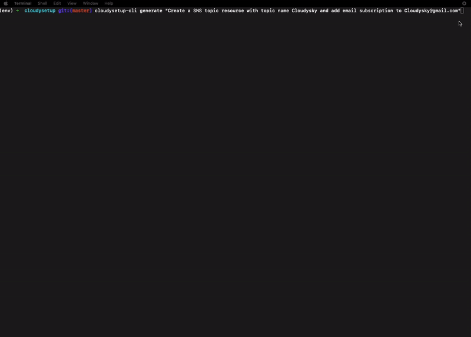

# CloudySetup

CloudySetup is a CLI tool designed to streamline AWS resource management using AWS Cloud Control API. It leverages `Amazon Bedrock` fully managed service with `Anthropic - Claude V2` Gen AI model to create, read, update, list, and delete AWS resources by generating configurations compatible with AWS Cloud Control API.




## Features

- Generate AWS resource configurations using generative AI and provides AI generated suggestions to improve the resource configuration. 
- Apply generated configurations to create, read, update, list, and delete resources and intent on each resources is determined through Generative AI. 
- Monitor resource creation status.
- Display suggestions for configuration improvements.
- Store configurations and state information locally.

## Installation

### Prerequisites

- Python 3.11+
- Virtual Environment (optional but recommended)
- `Cloudysetup-cli` uses the AWS configured credentials or can use short-lived session credentials through AWS profiles. Ensure that your AWS credentials are set up correctly before using the tool.
  ```sh
  aws configure
  ```

### Steps

1. **Clone the Repository**
   ```sh
   git clone https://github.com/mostlycloudysky/cloudysetup.git
   ```

2. **Create a Virtual Environment**
   ```sh
   python -m venv myenv
   source myenv/bin/activate  # On Windows use `myenv\Scripts\activate`
   ```

### Running the Backend FastAPI Service locally
1. **Navigate to the `cloudysetup` directory**
   ```sh
   cd cloudysetup
   ```
2. **Install dependancies**
   ```sh
   pip install -r requirements.txt
   ```
3. **Run the `FastAPI` server**
   ```sh
   uvicorn main:app --reload
   ```
The server will start on `http://localhost:8000`.

### Managed Backend FastAPI Service

You could also use the managed FastAPI Service deployed in ECS fronted by Route53. 
1. **Set the `BASE_URL` environment variable**
   ```sh
   export BASE_URL=https://cloudysetup.cloudysky.link
   ```
2. **Verify the `backend service` is running by accessing**
   ```sh
   curl $BASE_URL/docs
   ```

### Running the CLI locally
1. **Install dependancies and `cloudysetup-cli` from the root of the project**
   ```sh
   pip install -e .
   ```
2. **To generate a resource configuration, use the `generate` command**
   ```sh
   cloudysetup-cli generate "Create an SNS topic with topic name as cloudysky with an email subscription to  cloudysky@gmail.com address"
   ```

3. **To apply a generated configuration, use the `apply` command**
   ```sh
   cloudysetup-cli apply /path/to/generated_config.json --monitor
   ```
4. **`cloudysetup-cli` has following commands and can be found using the `--help` command**
   ```sh
   cloudysetup-cli --help
   ```
   
**Note: This project is experimental and intended for development only. It should not be used in production environments.**

### Contributing
Contributions are welcome! Please open an issue or submit a pull request on [GitHub](https://github.com/mostlycloudysky/cloudysetup/issues).

